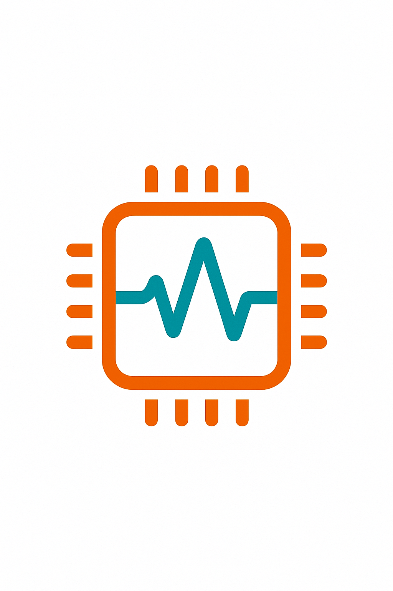

# EdgePlug

EdgePlug drops ready-made ML intelligence into legacy PLCs with a single firmware call. Grid operators stuck with brittle ladder logic can now swap in a spec-driven 'VoltageEventAgent v1.0' as easily as loading a function block.

<p align="center">
  
</p>

## Project Overview

EdgePlug converts fixed-function hardware into updatable, modular intelligence—so the grid evolves at software speed.

### Architecture

```
┌─────────────────┐    ┌─────────────────┐    ┌─────────────────┐
│   Web UI        │    │   Marketplace   │    │   Firmware      │
│   (React/TS)    │    │   & Cert        │    │   Runtime       │
│   + Design Sys  │    │   Pipeline      │    │   (C/C++)       │
└─────────────────┘    └─────────────────┘    └─────────────────┘
         │                       │                       │
         └───────────────────────┼───────────────────────┘
                                 │
                    ┌─────────────────┐
                    │   Observability │
                    │   & Remote Ops  │
                    └─────────────────┘
```

### Quick Start

```bash
# Clone the repository
git clone https://github.com/fraware/EdgePlug.git
cd EdgePlug

# Build firmware
cd runtime
cmake -B build -S .
cmake --build build

# Start web UI
cd ../ui
npm install
npm run dev

# Run tests
npm run test
npm run test:e2e
```

### Development

#### UI Development
```bash
cd ui
npm install
npm run dev          # Start development server
npm run build        # Build for production
npm run test         # Run unit tests
npm run test:e2e     # Run end-to-end tests
npm run storybook    # Launch component library
```

#### Firmware Development
```bash
cd runtime
cmake -B build -S .
cmake --build build
./build/tests/test_runtime  # Run runtime tests
```

### Project Structure

```
EdgePlug/
├── runtime/                 # C/C++ firmware runtime
│   ├── include/            # Public APIs
│   ├── src/               # Implementation
│   └── tests/             # Unit tests
├── ui/                     # React web interface
│   ├── components/        # Reusable UI components
│   ├── hooks/            # Custom React hooks
│   ├── design-system/    # Design tokens and styles
│   └── demo/             # Interactive demos
├── tools/                 # Development utilities
└── tests/                 # Integration tests
```

### License

Open-source core with paid certification packs for regulated industries.
