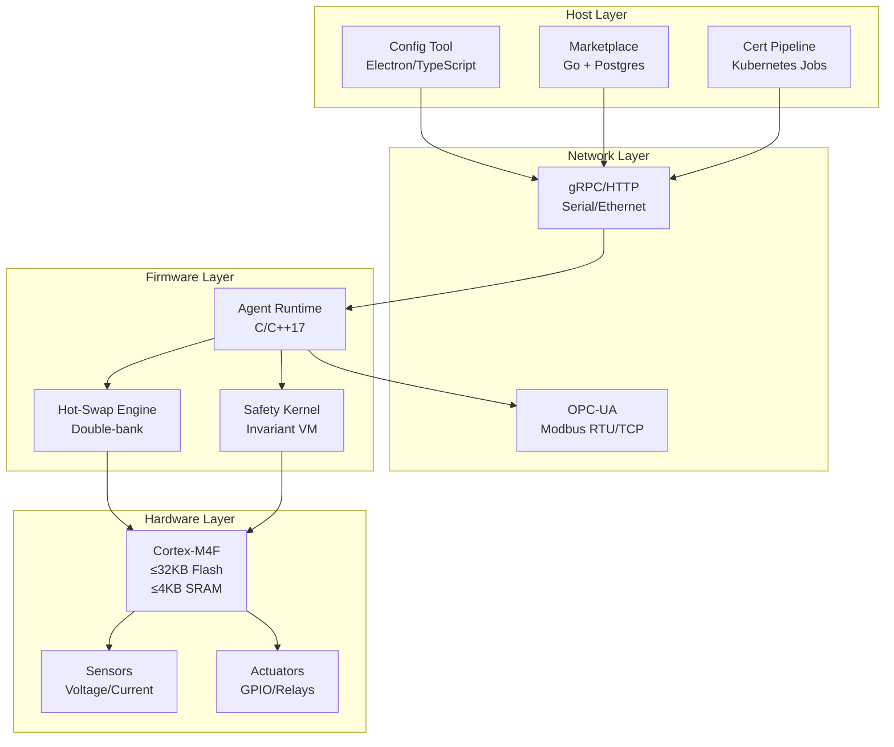
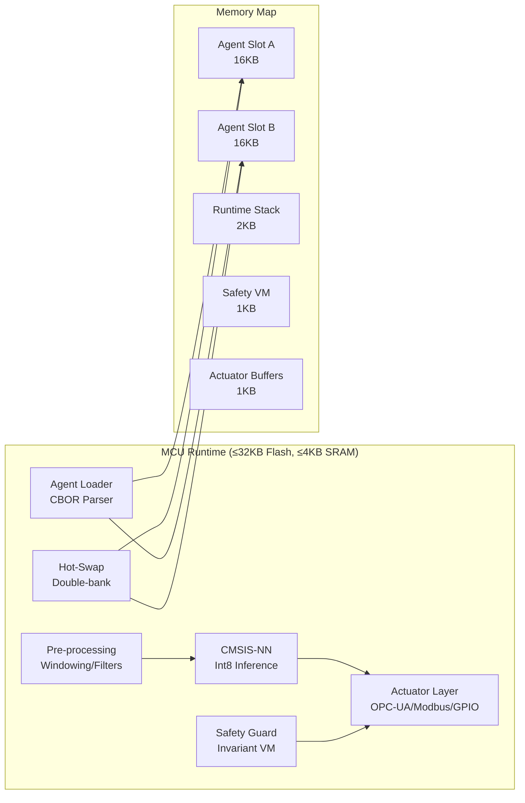
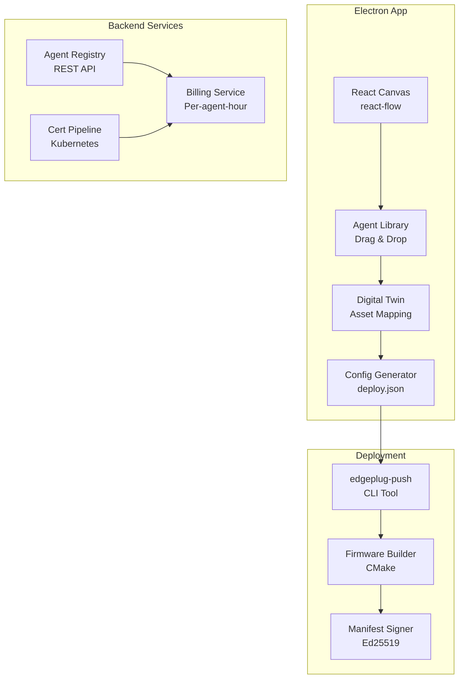
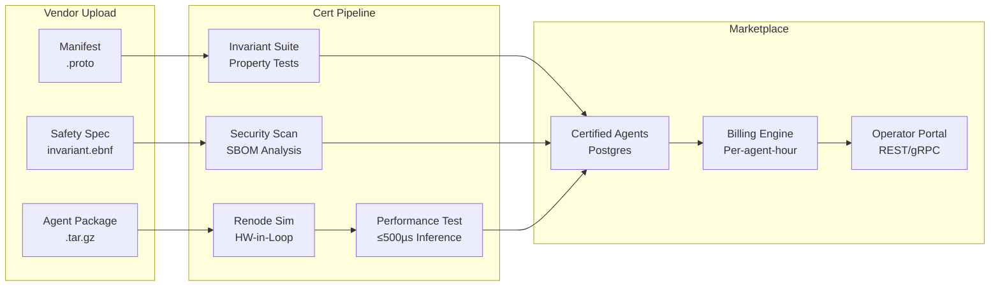
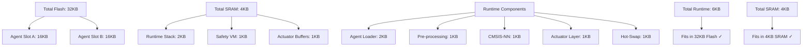
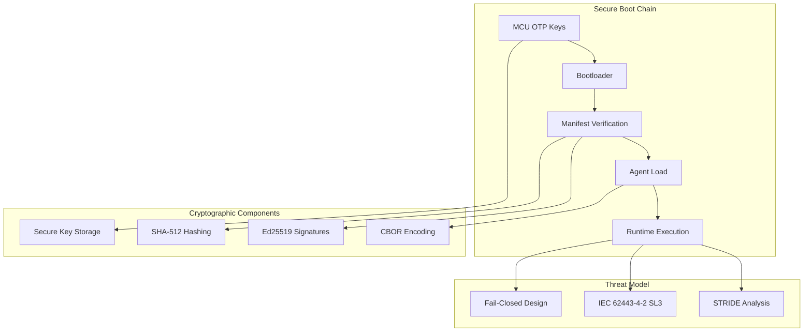

# EdgePlug System Architecture Blueprint

## Prompt 01 Deliverables

### 1. System Architecture Overview

### 2. MCU Runtime Layer Architecture

### 3. Host-Side Config Tool Architecture

### 4. Marketplace & Certification Pipeline

### 5. Module Interface Table

| Module | Public APIs | Data Contracts | Memory Budget | Latency Budget | Protocol Mappings |
|--------|-------------|----------------|---------------|----------------|-------------------|
| **Agent Loader** | `load_agent(cbor_data)` `verify_manifest(sig)` | CBOR-encoded agent image Ed25519 signature | 2KB stack 16KB agent slot | <100µs load time | CBOR, Ed25519 |
| **Pre-processing** | `window_data(samples, size)` `normalize_data(window)` | Float32 sensor samples Int8 normalized window | 1KB window buffer | <50µs per window | Raw ADC, I2C, SPI |
| **CMSIS-NN Runtime** | `infer_int8(input, model)` `quantize_fp32(fp32_data)` | Int8 quantized tensors CMSIS-NN model blob | 1KB inference buffer | <500µs inference | CMSIS-NN API |
| **Actuator Layer** | `write_opcua(node, value)` `write_modbus(addr, value)` `write_gpio(pin, state)` | OPC-UA node values Modbus registers GPIO states | 512B protocol buffers | <10ms actuation | OPC-UA, Modbus RTU/TCP, GPIO |
| **Safety Guard** | `check_invariant(inputs, spec)` `fail_closed()` | Invariant bytecode Safety bounds | 1KB VM stack | <10µs check | Custom bytecode |
| **Hot-Swap Engine** | `swap_agent(new_agent)` `rollback_on_failure()` | Double-bank agent slots CRC32 validation | 32KB total agent space | <1s swap time | gRPC over serial |
| **Config Tool** | `deploy_agent(asset, agent)` `generate_config()` | deploy.json Digital twin canvas | N/A (host) | <5s deployment | REST API, gRPC |
| **Marketplace** | `upload_agent(package)` `certify_agent(agent_id)` `bill_usage(agent_hours)` | Agent packages Cert results Billing records | N/A (cloud) | <300ms API calls | REST API, gRPC |

### 6. Memory Budget Verification

### 7. Security Architecture

### 8. Quality Gates - Prompt 01

#### Architecture Decision Record (ADR-001)
- [ ] Architecture reviewed by lead engineer
- [ ] Memory budgets verified at link-time
- [ ] Latency budgets validated with benchmarks
- [ ] Security architecture approved by security team
- [ ] Protocol mappings tested with real hardware

#### Static Analysis
- [ ] OCL rules defined for cyclic dependencies
- [ ] UML model validated with static analysis
- [ ] No forbidden cyclic dependencies found
- [ ] Architecture compliance verified

### 9. Next Steps

This architecture blueprint feeds into Prompt 02 (Firmware Runtime Implementation) where we will:
1. Implement the C/C++17 runtime library
2. Create CMake cross-build targets for STM32 & NXP
3. Implement memory-map documentation
4. Establish MISRA-C 2023 compliance 